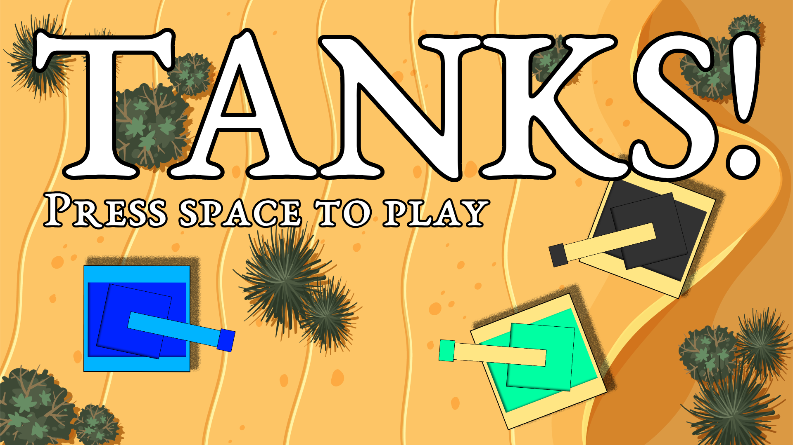
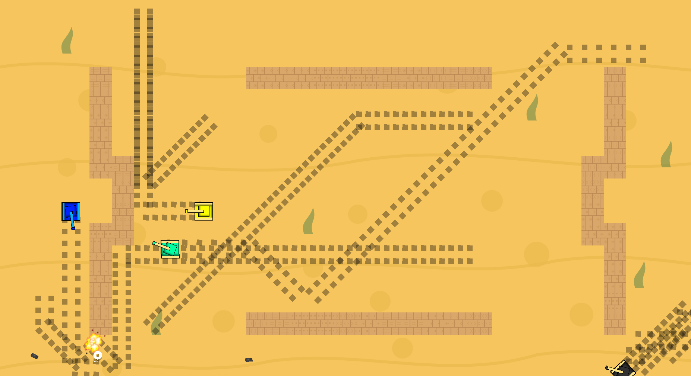
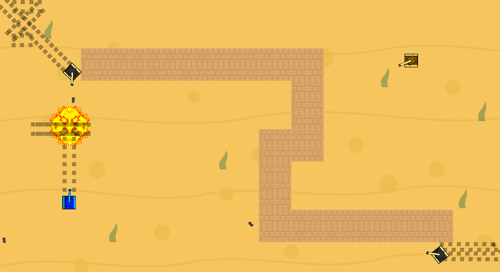
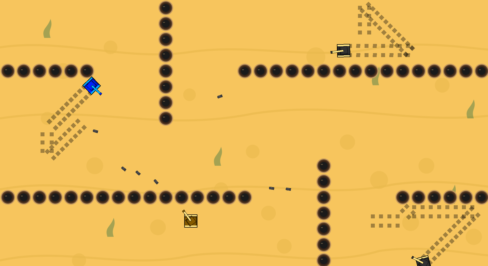
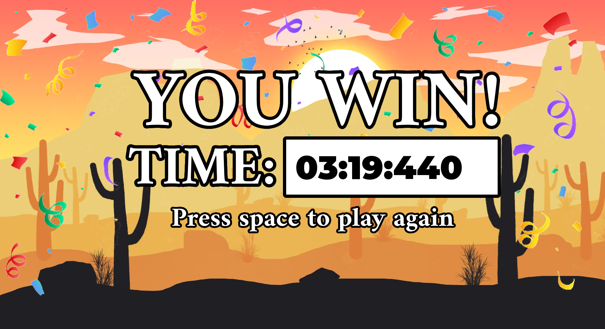
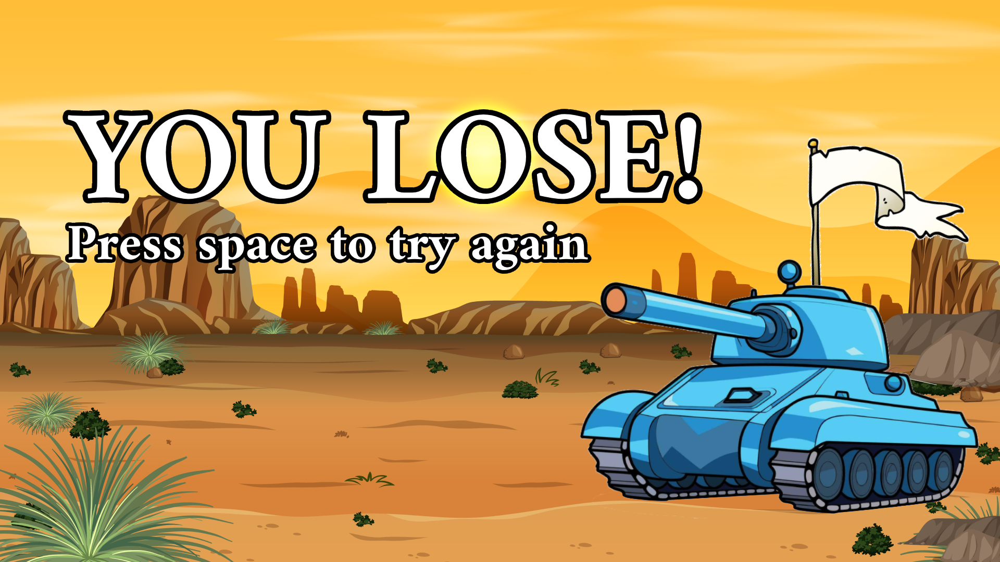

# 🚀 **TANKS!** | C++ Game Implementation

<div align="center">



**Wii Tanks recreation built in C++17 with SFML**

[](https://en.cppreference.com/w/cpp/17)
[](https://www.sfml-dev.org/)
[](https://cmake.org/)

*Tank combat game with AI enemies and physics-based projectiles*

</div>

---

## 📋 **Features**

### **Gameplay**
- **10 levels** with increasing difficulty
- **5 enemy tank types** with distinct AI behaviors
- **Physics-based bullets** with bouncing mechanics
- **Bomb deployment** with 5-second timer or manual detonation
- **3-life system** with level restart on death
- **Speedrun timer** for completion tracking

### **Technical Implementation**
- **Grid-based level design** with walls and holes
- **Real-time collision detection** (O(n²) brute force, optimized for <80 objects)
- **Line-of-sight AI** - enemies only shoot when player is visible
- **Probabilistic shooting** - each tank type has different aggression levels
- **Track-based movement** - tanks must rotate before changing direction
- **Memory management** with smart pointers for dynamic objects

---

## 🎮 **Gameplay Mechanics**



| System | Implementation |
|---------|---------------|
| **Movement** | 8-directional WASD with rotation constraints |
| **Combat** | Mouse aiming, left-click shooting, limited bullet count |
| **AI Behavior** | 5 tank types: static, random movement, player tracking, bomb deployment, advanced tactics |
| **Physics** | Bullet bouncing off walls with angle calculations |
| **Level Design** | Walls (impassable), holes (tanks can't cross, bullets pass through) |

---

## 🏗️ **Technical Details**

### **Architecture**
```cpp
// Core systems
- Tank class with behavior flags (setLevelTwoTank(), etc.)
- Bullet physics with collision detection
- Grid-based level management
- SFML sprite rendering with texture atlasing
```

### **Performance**
- **Target**: 144 FPS
- **Object count**: ~80 entities max (walls, tanks, bullets)
- **Collision**: Brute force O(n²) - no spatial partitioning needed at this scale
- **Memory**: Smart pointers prevent leaks, minimal dynamic allocation

### **AI Implementation**
- **Level 1**: Stationary tanks
- **Level 2**: Random movement patterns
- **Level 3**: Player pursuit algorithms  
- **Level 4**: Strategic bomb placement near player (4 bombs max at once)
- **Level 5**: All the best parts from lower levels into one

---

## 🚀 **Build Instructions**

### **Prerequisites**
```bash
# Ubuntu/Debian
sudo apt install cmake build-essential
```

### **Compilation**
```bash
git clone https://github.com/TimothyPav/wii-tanks.git
cd wii-tanks
mkdir build && cd build
cmake ..
make
./tanks
```

**Note**: SFML dependencies are automatically fetched via CMake. Game may segfault occasionally due to unresolved memory issues. :(

---

## 🎯 **Controls**

| Input | Action |
|-------|--------|
| `WASD` | Tank movement |
| `Mouse` | Turret aiming |
| `Left Click` | Fire bullet |
| `Space` | Deploy bomb |

---

## 📊 **Technical Specifications**

- **Language**: C++17
- **Graphics**: SFML 3.0.0
- **Build System**: CMake with FetchContent
- **Rendering**: Sprite-based with animations
- **Audio**: None implemented
- **Platform**: Linux (Ubuntu), No idea if Windows will work

---

## ⚠️ **Known Issues**

- Segmentation faults occur in ~20% of full playthroughs
- Code architecture is not maintainable (monolithic Tank class)
- No release packaging or distribution method
- Collision detection uses magic numbers for edge cases

---

<div align="center">

| Gameplay | Gameplay |
|----------|----------|
|  |  |

| Win Screen | Lose Screen |
|------------|-------------|
|  |  |

</div>
